<h1 align="center">helpdiff</h1>
<p align="center"><b>Diff the <code>--help</code> surface of any CLI between versions, and find the scripts that would break.</b></p>

<p align="center">
  <a href="https://github.com/Nithinfgs/helpdiff/actions/workflows/ci.yml"></a>
  
  
  <a href="LICENSE"></a>
</p>

<p align="center"></p>

OpenAPI has `oasdiff`. GraphQL has schema diffing. **Command-line tools ship breaking changes all the time** (a removed flag, a renamed subcommand, a `--verbose` that suddenly wants a value) and nothing tells you until a cron job fails.

`helpdiff` crawls a tool's `--help` tree into a plain JSON snapshot, diffs two snapshots, and checks the shell scripts, Makefiles, CI YAML and Dockerfiles you actually have against the result. Offline, no dependencies, no network.

## Quick start

```sh
pipx install git+https://github.com/Nithinfgs/helpdiff     # or: uvx --from git+https://github.com/Nithinfgs/helpdiff helpdiff
```

Try it on the bundled example (two releases of a fictional `acme` CLI plus the scripts that use it):

```sh
git clone https://github.com/Nithinfgs/helpdiff && cd helpdiff/examples/acme
helpdiff diff snapshots/acme-1.9.0.json snapshots/acme-2.0.0.json --scripts scripts/
```

On your own tools:

```sh
# 1. before upgrading: snapshot what you have
helpdiff snap "terraform" -o terraform-1.8.json

# 2. after upgrading: snapshot again and compare, scanning your repo for fallout
helpdiff snap "terraform" -o terraform-1.9.json
helpdiff diff terraform-1.8.json terraform-1.9.json --scripts .
```

`snap` only runs `<command> [subcommand…] --help` (see [Safety](#safety)). Exit status is `1` if anything breaking was found, so it drops straight into CI.

## What it catches

| Severity | Examples |
| --- | --- |
| **breaking** | removed command / flag / alias; `--force` renamed (with a "looks renamed to `--yes`" hint); a switch that now takes a value; a choice that is no longer accepted; a new required flag or argument; a command that moved (`logs` → `service logs`) |
| **warning** | changed default; value type change; flag newly deprecated; value restricted to a fixed set |
| **info** | new commands, flags, aliases, choices (hidden unless `--all`) |

With `--scripts PATH…` it also scans your files and reports the exact lines that *the upgrade* broke: unknown flags and subcommands, values outside a flag's choices, missing values or required arguments. It reports only what is **new against the old snapshot**, so anything its shell parsing cannot understand cancels out instead of becoming noise.

## Commands

| Command | Purpose |
| --- | --- |
| `helpdiff snap CMD -o FILE` | crawl `CMD`'s help tree into a snapshot (`--name`, `--max-depth`, `--skip`, `--jobs`, `--help-flag`…) |
| `helpdiff diff OLD NEW [--scripts PATH…]` | compare snapshots; `--format text\|markdown\|json`, `--fail-on breaking\|warning\|never`, `--all` |
| `helpdiff verify CMD --snapshot FILE` | crawl live and diff against a committed snapshot; `--update` refreshes it |
| `helpdiff check SNAPSHOT PATH…` | find unknown flags/subcommands in scripts against one snapshot |
| `helpdiff show SNAPSHOT` / `helpdiff parse FILE` | inspect a snapshot / debug the parser on one saved help text |

### For CLI maintainers: a "lockfile" for your command-line surface

Commit a snapshot and let CI fail when a PR changes it by accident:

```yaml
# .github/workflows/cli-surface.yml
- run: pipx install git+https://github.com/Nithinfgs/helpdiff
- run: helpdiff verify "python -m mytool" --name mytool --snapshot cli.snapshot.json --format markdown >> "$GITHUB_STEP_SUMMARY"
```

Intentional change? Run `helpdiff verify … --update` and commit the new snapshot; the diff of `cli.snapshot.json` is the review artifact. Snapshots are deterministic (sorted, no timestamps), so reviews stay small.

## How it works

```
 tool --help ─┐                         ┌─ breaking / warning / info
 tool a --help├─► parser ─► snapshot ─► diff ─┤
 tool a b --help┘   (JSON, sorted)      └─ + scripts ─► check ─► "deploy.sh:5: --force is not a flag"
```

1. **Crawl**: breadth-first over subcommands, parallel, with timeouts. `NO_COLOR`, `COLUMNS=200` and `CI=1` are set so output is stable; a subcommand whose help equals its parent's is treated as "not a real command".
2. **Parse**: a heuristic parser for the shared conventions of argparse, optparse, click, cobra, clap and commander: section headings, `-s, --long VALUE  description` rows, `{a,b}` / `[possible values: …]` choices, `(default …)`, `Aliases:`, usage lines for positional arguments. Unrecognised text is ignored, never guessed.
3. **Diff**: flags are matched by name with alias tolerance, then classified by what they do to *callers*. Removed + added flags with similar names or descriptions yield a rename hint.
4. **Check**: shell-aware tokenising (continuations, pipes, `&&`, `sudo`, env prefixes, YAML `run:`, Markdown fences) walks each invocation down the command tree. Dynamic words (`$VAR`, globs) stop the walk instead of producing guesses.

## Accuracy and limitations

Help output has no standard, so this is a heuristic tool. Be aware of what that means:

- Verified by running it on real tools: `gh` (230 commands / 1,365 flags parsed in ~2 s, identical snapshots across runs), `pip`, `node`, plus unit-test fixtures for argparse, optparse, click, cobra, clap and commander layouts (`pytest`).
- **Not supported yet:** tools whose help is a man page or prose rather than sectioned lists. `git` and `npm` subcommand lists are examples: `helpdiff` will snapshot their root flags but not discover their subcommands.
- Flags that are only documented in prose, or hidden from `--help`, are invisible. Flags are compared, not their runtime behaviour: a changed *meaning* with the same name is not detected.
- `--scripts` understands shell-like syntax, not every shell feature (no variable expansion, no here-docs). It deliberately errs towards silence.
- Hand-check surprising output with `helpdiff parse help.txt`; parser bugs with a pasted help text are very welcome issues.

## Safety

`helpdiff snap` and `verify` **execute the command you give them** with `--help` appended (and `--version` once at the root), plus any subcommand names printed by that tool's own help. Only crawl tools you would be comfortable running. stdin is closed, each call has a timeout, and nothing is written except the snapshot file. `diff`, `check`, `show` and `parse` never run anything.

## Roadmap

- man-page style / prose help (`git`, `npm`) and `docopt` layouts
- GitHub Action wrapper with PR comments
- detect changed meaning via description diffs (opt-in)
- `helpdiff snap --from-docs` for tools that publish generated reference pages

## Contributing

Parser fixtures are the cheapest, most valuable contribution: paste the `--help` of a tool that parses badly into `tests/fixtures/`, add the expectation, and open a PR. See [CONTRIBUTING.md](CONTRIBUTING.md).

```sh
pip install -e ".[dev]" && pytest && ruff check . && ruff format --check . && mypy
```

## License

[MIT](LICENSE)
